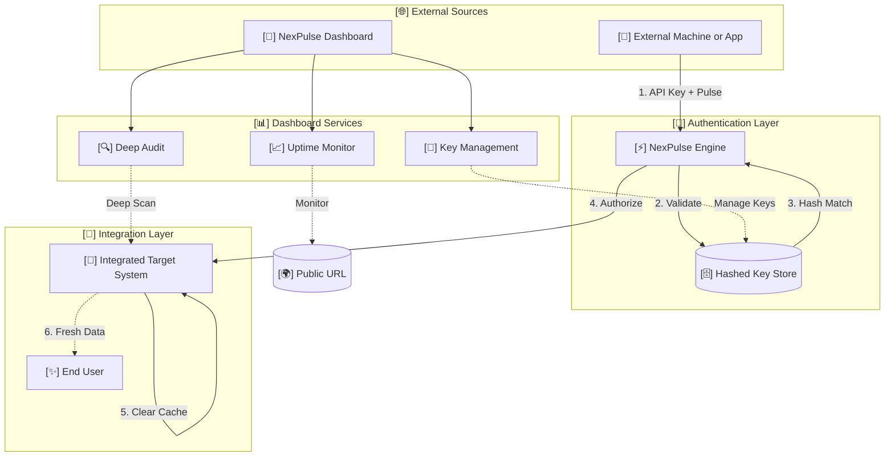

# NexPulse Master Documentation

This document provides a comprehensive technical and conceptual overview of the NexPulse SaaS platform. It is designed to guide both administrators and developers through the system architecture, features, and integration patterns.

In high-performance web environments, caching and uptime are critical. NexPulse provides a centralized **Optimization Hub** where developers can trigger global cache refreshes (**Optimization Pulses**) and monitor website health with real-time **Uptime Alerts** via email and webhooks.

## Architecture and Data Flow

NexPulse operates as a decoupled three-layer system:

1.  **Command Center (Dashboard)**: A premium interface for user registration, API key management, and real-time website auditing.
2.  **Persistence Layer (Database)**: An encrypted vault powered by Prisma and PostgreSQL. We store only the cryptographic hashes of API keys to ensure zero-knowledge security.
3.  **Pulse Engine (API)**: A high-concurrency API layer that validates incoming machine requests and dispatches optimization signals.

### Data Flow Diagram



## Core Features

### Optimization Pulse (Remote Cache Revalidation)
NexPulse enables "Tag-based Revalidation." By tagging data fetches in your application (e.g., `inventory`, `pricing`), you can use the NexPulse API to clear those specific tags globally in milliseconds. Each optimization triggers a professional **Optimization Signal** email alert to the account holder.

### Uptime Monitoring & Alerts
The Pulse Engine continuously monitors your web properties for downtime. 
- **Real-time Detection**: Automatic health checks every 60 seconds.
- **Smart Alerts**: Instant email notifications for `UP` and `DOWN` status changes.
- **Latency Tracking**: High-fidelity reporting of response times across global endpoints.


### Website Pulse Audit
The built-in audit engine performs multi-dimensional scans on web properties. 
- **Security & Access**: While simple scans can be initiated via the Dashboard, all programmatic audits via the Pulse API **require a verified Machine API Key**.
- **Integrated Intelligence**: Audits are most effective when NexPulse is integrated into the target system, allowing for deep diagnostic reporting on SEO, Security (SSL/HSTS), and Performance (TTFB/Script density).

### Pulse-AI (Technical Assistant)
NexPulse includes **Pulse-AI**, an autonomous technical agent located at the bottom-right of the dashboard. Pulse-AI is trained on the NexPulse protocol and can assist with API implementation, webhook setup, and interpreting diagnostic reports.

### Advanced Monitoring Details
Selecting any monitor opens the **Advanced Details** view, providing:
- **High-Fidelity Charts**: Real-time latency and status history.
- **Trigger Intelligence**: Visibility into active webhooks and email alerts linked to the specific target.
- **System Metrics**: Monitoring node information and SSL certificate status.

### Activity & Audit Logs
The **Activity Logs** section provides a complete transparency layer for your account. It records all significant events, including:
- **API handshakes** and revalidation pulses.
- **Administrative changes** (Key generation, monitor deletions).
- **Security events** (Login attempts, password resets).

### Profile & Identity
The **Profile** section allows for granular management of user data, including secure password updates, plan visibility, and profile image customization.

### Security and Hashing
Machine-level security is handled via high-entropy API keys.
- **Generation**: A unique key is generated once.
- **Hashing**: We store only the **SHA-256 Hash** of the key.
- **Verification**: When a request arrives, we hash the input and compare it to the stored value. This ensures your raw keys are never stored in plain text.

## Integration Guide
To integrate NexPulse into your own environment, follow these standard implementation patterns.

### Authentication Header
Every machine request must include your API key in the Authorization header:
`Authorization: Bearer <your_api_key>`

## Web Implementation (JavaScript / Node.js)
```javascript
const triggerOptimization = async (tag) => {
  const response = await fetch("https://nextjs-optimizer-suite.vercel.app/api/revalidate", {
    method: "POST",
    headers: {
      "Content-Type": "application/json",
      "Authorization": "Bearer opt_live_..." 
    },
    body: JSON.stringify({ tag: tag }) 
  });
  
  if (response.ok) console.log("Pulse Sent Successfully");
};
```

## iOS Implementation (Swift)
```swift
import Foundation

func sendNexPulse(tag: String, apiKey: String) {
    let url = URL(string: "https://nextjs-optimizer-suite.vercel.app/api/revalidate")!
    var request = URLRequest(url: url)
    request.httpMethod = "POST"
    request.setValue("application/json", forHTTPHeaderField: "Content-Type")
    request.setValue("Bearer \(apiKey)", forHTTPHeaderField: "Authorization")
    
    let body: [String: Any] = ["tag": tag]
    request.httpBody = try? JSONSerialization.data(withJSONObject: body)
    
    URLSession.shared.dataTask(with: request) { data, response, error in
        if let httpResponse = response as? HTTPURLResponse, httpResponse.statusCode == 200 {
            print("NexPulse: Global Refresh Triggered")
        }
    }.resume()
}
```

## Python Implementation
```python
import requests

def trigger_pulse(tag, api_key):
    url = "https://nextjs-optimizer-suite.vercel.app/api/revalidate"
    headers = {
        "Authorization": f"Bearer {api_key}",
        "Content-Type": "application/json"
    }
    data = {"tag": tag}
    
    response = requests.post(url, json=data, headers=headers)
    if response.status_code == 200:
        print("NexPulse: Optimization Success")
```

## Go Implementation
```go
package main

import (
    "bytes"
    "net/http"
)

func triggerPulse(tag string, apiKey string) {
    url := "https://nextjs-optimizer-suite.vercel.app/api/revalidate"
    jsonBody := []byte(`{"tag": "` + tag + `"}`)
    
    req, _ := http.NewRequest("POST", url, bytes.NewBuffer(jsonBody))
    req.Header.Set("Content-Type", "application/json")
    req.Header.Set("Authorization", "Bearer "+apiKey)
    
    client := &http.Client{}
    resp, err := client.Do(req)
    if err == nil && resp.StatusCode == 200 {
        // Success
    }
}
```

## Ruby Implementation
```ruby
require 'net/http'
require 'json'

def trigger_pulse(tag, api_key)
  uri = URI('https://nextjs-optimizer-suite.vercel.app/api/revalidate')
  http = Net::HTTP.new(uri.host, uri.port)
  http.use_ssl = true
  
  request = Net::HTTP::Post.new(uri.path, {
    'Content-Type' => 'application/json',
    'Authorization' => "Bearer #{api_key}"
  })
  
  request.body = { tag: tag }.to_json
  response = http.request(request)
  puts "Success" if response.code == "200"
end
```

## Android Implementation (Kotlin)
```kotlin
fun sendPulse(tag: String, apiKey: String) {
    val client = OkHttpClient()
    val body = "{\"tag\": \"$tag\"}".toRequestBody("application/json".toMediaType())
    
    val request = Request.Builder()
        .url("https://nextjs-optimizer-suite.vercel.app/api/revalidate")
        .addHeader("Authorization", "Bearer $apiKey")
        .post(body)
        .build()

    client.newCall(request).enqueue(object : Callback {
        override fun onResponse(call: Call, response: Response) {
            if (response.isSuccessful) { /* Success */ }
        }
    })
}
```

## Technical Specification
- **Engine**: Next.js 15+
- **Database**: Prisma with PostgreSQL
- **Security**: SHA-256 Key Hashing & JWT Sessions
- **Deployment**: Optimized for Vercel and Docker

## Webhooks
NexPulse supports automated event notifications via HTTP webhooks. This is primarily used for real-time alerting on Discord, Slack, or custom endpoints when a Pulse is triggered or a scan is completed.

### Discord Integration
To connect NexPulse to Discord:
1. Create a Webhook URL in your Discord Channel Settings.
2. Add the URL to the **Webhooks** tab in the NexPulse Dashboard.
3. NexPulse will now send professional embed notifications whenever your web properties are optimized.

> [!NOTE]
> For detailed API endpoint specifications, refer to the **[API Reference](./api)**. For conceptual analogies, see **[Core Concepts](./concepts)**.
