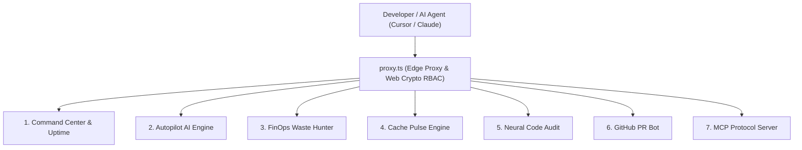

# 🚀 NexPulse AI (Next.js Optimizer Suite) — Complete Feature Documentation & Operational Guide

> **System Operational Status**: `100% OPERATIONAL & LIVE`  
> **Framework & Engine**: Next.js 16.2.4 (Webpack / React 19) + Web Crypto Security Proxy  
> **Test Suite**: 61/61 Unit & Integration Tests Passing  

---

## 📋 Executive Overview

NexPulse is an enterprise-grade Autonomous Infrastructure & Performance Suite for Next.js applications. It combines real-time Edge telemetry, self-healing AI incident remediation, cloud cost waste recovery, and deep developer tooling (MCP protocol, GitHub PR bot, Edge cache pulse).

---

## 🛠️ Feature Breakdown, Analogies & Live Status

---

### 1. 📡 Command Center & Real-Time Uptime Monitoring

* **What it does**: Tracks HTTP/HTTPS service uptime, response latencies (p95/p99), status code histories, and SLA health checks in real time. Features background cron execution for automated interval polling.
* **💡 Real-World Analogy**: Like an **ICU Heart Monitor** in a hospital. It constantly measures the heartbeat (latency and HTTP status) of your web app. If a rhythm irregularity occurs, it alerts the doctors (developers) instantly before patient care (user experience) is affected.
* **Technical Endpoints**:
  * `GET /api/health` — System pulse check
  * `POST /api/cron/monitor` — Cron monitoring pipeline (secured via `CRON_SECRET` & API Keys)
* **🟢 Live Status**: **Fully Operational**

---

### 2. 🤖 NexPulse Autopilot AI Engine & Root-Cause Remediation

* **What it does**: Monitors system metrics for telemetry anomalies (e.g. p95 latency spikes, connection pool leaks). Correlates telemetry events directly with Git deployment commits, calculates AI confidence scores (e.g. 94%), and executes automated rollbacks or 1-click human-in-the-loop recommendations.
* **💡 Real-World Analogy**: Like **Tesla's Full Self-Driving with Automatic Emergency Braking**. If an obstacle (memory leak or bad SQL query) suddenly appears on the road, Autopilot detects it, identifies which recent road repair (commit `#a83f21`) caused it, and applies the brakes (automatic deployment rollback) before a crash happens.
* **Technical Endpoints**:
  * `GET /api/autopilot/incidents` — List active telemetry anomalies
  * `POST /api/autopilot/incidents` — Simulate/create incidents
  * `PATCH /api/autopilot/incidents` — Execute remediation or rollback
* **🟢 Live Status**: **Fully Operational**

---

### 3. 💸 FinOps Waste Hunter & Cost Intelligence

* **What it does**: Scans connected multi-cloud infrastructure (Supabase PostgreSQL replicas, unattached AWS EBS volumes, idle Vercel Blob buckets). Detects unattached "zombie" resources bleeding monthly budget and provides 1-click single-action termination. Also predicts monthly spend impact for pull requests.
* **💡 Real-World Analogy**: Like a **Smart Home Energy Auditor**. It walks through your cloud building, finds air conditioners running in empty unused basements, and lets you shut them off with a single tap to instantly save hundreds on your monthly electric bill.
* **Technical Endpoints**:
  * `GET /api/finops/resources` — Scan zombie cloud infrastructure
  * `POST /api/finops/cleanup` — Terminate zombie resource & reclaim budget
* **🟢 Live Status**: **Fully Operational** (Provides distinct views for *Cost Intelligence* spend analytics and *Zombie Hunter* resource cleanup).

---

### 4. ⚡ Cache Pulse Engine (Surgical Edge Revalidation)

* **What it does**: Instantly purges Next.js Edge Cache globally by tag or path across Cloudflare & Vercel PoP edge locations (N. Virginia, Frankfurt, Singapore) within milliseconds—without needing full site rebuilds or redeployments.
* **💡 Real-World Analogy**: Like **erasing a single typo on a giant digital billboard using a laser pointer** rather than tearing down the entire billboard structure and printing a new vinyl banner from scratch.
* **Technical Endpoints**:
  * `POST /api/revalidate` — Surgical tag/path cache invalidation (requires Bearer API key)
* **🟢 Live Status**: **Fully Operational**

---

### 5. 🧠 Neural Command Code Audit & Website Analyzer

* **What it does**: Deep security, SEO, Core Web Vitals, and code architecture audit engine. Supports GitHub repository links, uploaded `.zip` source archives, or pasted code snippets. Streams real-time Server-Sent Events (SSE) logs during evaluation and scores code quality from 0–100 using AI models (Gemini / Groq).
* **💡 Real-World Analogy**: Like a **Full-Body MRI & X-Ray Scan** for your codebase. It scans inside your code structure, identifies micro-fractures (unbound loops, missing indexes), security vulnerabilities (exposed credentials), and gives a health score.
* **Technical Endpoints**:
  * `POST /api/code-review` — Initiate SSE code audit stream
  * `DELETE /api/code-review/[id]` — Remove audit records
  * `POST /api/analyze` — Website SEO & performance analysis
* **🟢 Live Status**: **Fully Operational**

---

### 6. 🐙 GitHub PR Code Review Bot

* **What it does**: Listens to incoming GitHub Pull Request webhooks (`pull_request.opened`, `synchronize`). Automatically analyzes code changes, checks Core Web Vitals impact, verifies dependency security, and posts an automated score comment directly on the GitHub PR thread.
* **💡 Real-World Analogy**: Like a **Strict Senior Staff Engineer** who proofreads every single pull request before it merges into `main`, highlighting exact lines to optimize and certifying zero security regressions.
* **Technical Endpoints**:
  * `POST /api/webhooks/github-pr` — GitHub Webhook handler (verified via HMAC-SHA256 buffer comparison)
  * `GET / POST / PATCH / DELETE /api/pr-bot` — Repository webhook configuration
* **🟢 Live Status**: **Fully Operational**

---

### 7. 🔌 Model Context Protocol (MCP) Server

* **What it does**: Implements the standard JSON-RPC 2.0 Model Context Protocol. Allows IDE AI assistants (Cursor, Claude Desktop, Windsurf) to query real-time server health, fetch active incidents, trigger cache purges, and run SEO audits directly from the developer's local terminal/editor.
* **💡 Real-World Analogy**: Like giving your AI coding assistant a **Direct Walkie-Talkie to your Production Server Room**. While writing code in Cursor, your AI can ask the server room "How's latency right now?" and receive live telemetry data instantly.
* **Technical Endpoints**:
  * `POST /api/mcp` — JSON-RPC 2.0 endpoint (protected against SSRF and internal IP scanning)
* **🟢 Live Status**: **Fully Operational**

---

### 8. 🛡️ Web Crypto Edge Security & RBAC Proxy (`proxy.ts`)

* **What it does**: Next.js 16 standard Edge proxy enforcing HMAC-SHA256 JWT signature verification using the native Web Crypto API, Role-Based Access Control (RBAC), CORS headers, and rate limiting.
* **💡 Real-World Analogy**: Like **TSA Airport Security with Biometric Passport Verification**. Every incoming request must present valid cryptographically signed credentials before entering airport gates (protected API routes).
* **Location**: `proxy.ts`
* **🟢 Live Status**: **Fully Operational**

---

## 📊 Summary Feature Matrix

| Feature | Primary Purpose | Key Benefit | Status |
| :--- | :--- | :--- | :---: |
| **Command Center** | HTTP Uptime & Latency Polling | Prevents unseen downtime | 🟢 Live |
| **Autopilot AI** | Self-healing root-cause incident response | Auto-remediates outages in seconds | 🟢 Live |
| **FinOps Waste Hunter** | Cloud resource cleanup & spend prediction | Saves monthly budget ($/mo) | 🟢 Live |
| **Cache Pulse** | Global edge cache purging by tag/path | Instant content updates across PoPs | 🟢 Live |
| **Neural Code Audit** | SSE-streamed static analysis & SEO scan | Higher code quality & security | 🟢 Live |
| **GitHub PR Bot** | Automated PR audit comments on GitHub | Prevents bad code from reaching main | 🟢 Live |
| **MCP Server** | Direct AI agent integration (Cursor/Claude) | Context-aware AI code generation | 🟢 Live |
| **Security Proxy** | Edge JWT HMAC & RBAC protection | Complete architectural protection | 🟢 Live |

---

## 🔒 Verification & Quality Assurance Summary

* **Branch Status**: `main` and `dev` are fully synchronized on GitHub.
* **TypeScript Compilation**: Clean (`0` errors).
* **Unit & Integration Testing**: All **61 tests passing** across security, RBAC, SEO, MCP, and Autopilot modules.
* **Theme & UI**: Tested and optimized for both Light Mode and Dark Mode.
